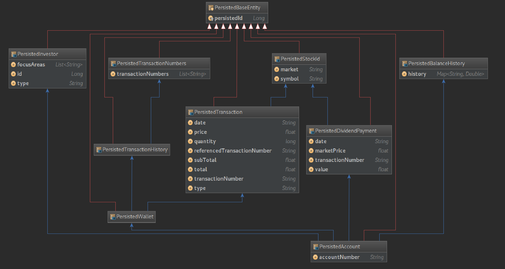

# Trading API [](https://travis-ci.com/GLO4002UL/projet2018-eq13) [](https://codecov.io/gh/GLO4002UL/projet2018-eq13)

> Rest API for stock market investment and portfolio management developed in the context of the course **GLO-4002/IFT-6002 - Qualité logicielle**

## Collaborators
### DesiredError - Team #13
| IDUL | Name | NI | GitHub Username | Email |
| :---: | :---: | :---: | :---: | :---: |
| TRBRO4 | Brodeur, Tristan | 111 091 005 | tbjd | tristan.brodeur.1@ulaval.ca |
| SACAC1 | Cabral Cruz, Samuel | 111 006 369 | SamuelCabralCruz | samuel.cabral-cruz.1@ulaval.ca |
| EDCAR29 | Carré, Édouard | 111 152 547 | allereddou | edouard.carre.1@ulaval.ca |
| OLGAM4 | Gamache, Olivier | 111 153 499 | olgam4 | olivier.gamache.3@ulaval.ca |
| GALEG29 | Legault, Gabriel | 111 089 063 | Gabswim | gabriel.legault.1@ulaval.ca |
| EMPRO18 | Provencher, Émile | 111 104 772 | emileprovencher | emile.provencher.1@ulaval.ca |
| CLQUA | Quaresma, Clément | 111 244 593 | quaresc | clement.quaresma.1@ulaval.ca |
| ASTAN3 | Tanguy, Anne-Sophie | 111 244 605 | tanguy-a | anne-sophie.tanguy.1@ulaval.ca |
| MOTOU40 | Tourigny, Marc-Olivier | 111 048 727 | Ocramout | marc-olivier.tourigny.1@ulaval.ca |

## Project status
| User Story | Description | Status | Release |
| :---: | :--- | :---: | :---: |
| COOU | Ouvrir un compte avec des crédits | Done | 1.0.0 |
| TXAC | Effectuer un achat | Done | 1.0.0 |
| TXVE | Effectuer une vente | Done | 1.0.0 |
| TXFR | Appliquer des frais de transaction | Done | 1.0.0 |
| REVIEW 1 | Refactor project based on feedback from first code review | Done | 2.0.0 |
| TXHO | Refuser les transactions en dehors des heures d’ouverture | Done | 2.1.0 |
| RTHI | Lister l’historique des transactions | Done | 2.1.0 |
| RTBA | Calculer la valeur du portefeuille | Done | 2.1.0 |
| EVDI | Traiter l’émission d’un dividende | Done | 2.1.0 |
| RTPO | Afficher le rapport trimestriel | Done | 2.1.0 |
| REFACTOR 1 | Clean up code base before delivery 2 | Done | 2.1.1 |

## Project Structure
This project is made of these maven modules:

  - ``stocks-api``: An API which allow to retrieve stocks value. In the context of this project, this module is considered as an external service. Therefore, we are constraint to use it as it is and not edit it. Also, we should not refer to it directly, but to pass by its REST API as documented [here](https://glo4002stocksapi.docs.apiary.io/).
  - ``trading-api``: The REST API that we are requested to build. All the acception criteria are available on the following [website](http://projet2018.qualitelogicielle.ca/).
  - ``trading-api-test``: This module contains the integrated tests for the ``trading-api`` module.
  - ``application``: This module simply allows to start both APIs at the same time.

## Disclosure
This section list all the important disclosure about the project architecture decision and the explanation behind those decisions.

### Intensive Usage of Serialization/Deserialization
Based on the first code review, we realized that our architecture was suffering due to lack of centralization for the conversion and validation of the inputs and the formatting of the outputs. After some researches, we found out that `Jackson` library provide a nice way to simplify those cumbersome tasks by defining custom serializers and deserializers.

Moving forward, we then decided to enforce the usage of our value objects (such as TransactionNumber, InvestorId, AccountNumber, Credits, etc.) all the way to the top layer of the application and to let `Jackson` deal with the serialization and deserialization of those objects. The mapping of the different classes with their corresponding serializer and deserializer is defined into the `CustomJsonProvider` class.

In regards of the query parameters needed for the report generation, we used a similar process by defining custom `ConverterProvider` classes. Hence, instead of receiving the query parameters as plain string objects, those will already by checked and converted to the desired class (such as `ReportType`, `LocalDate`, etc).

Even if the usage of such a technology comes to the price of lots of additional classes, it allows for a better reutilization of the conversion and validation logic. Also, it avoids to pollute the architecture with such low level details.

### Persistence
#### Hibernate
##### Why we used it?
Due to client request, we have been constrained to use Hibernate with H2 databases to persist application data.

##### What is Hibernate?
Hibernate is a very powerful and useful tool when working with CRUD applications having anemic domains. However, when it comes to the use with a rich domain there are some issues to be addressed.

First of all, Hibernate needs a full access to all the domain objects that have to be persisted. Therefore, every classes that have to be persisted are forced to implement a default constructor and getters/setters on every attributes that have to be persisted to retrieve the state of the object. Furthermore, attributes cannot be declared as final. Finally, like if it was not yet enough, the scope of the different classes has to be public so hibernate can instantiate the objects. All these requirements put together lead to an open-wide access of domain objects not only for hibernate, but also for all the other plugins. In principle, there is no real harm of such changes, but it can be comprising and promote bad design if the use of this flexibility is wrongly used by future developers.

Second of all, Hibernate pollutes the domain objects with annotations that are necessary to indicate the scheme of the database to be created. Although these annotations are from a native java library (`javax.persistence`), we still consider that it is an intrusive technology for the domain layer which should be plain java code based on Domain Driven Design (DDD) principles.

Third of all, there are some limitations on data structures and the content that Hibernate can persist. Among the different problems we faced, we had to change all the dates for strings. Actually Hibernate supports persistence of java date instances, but it fails to cover the whole range of available dates. To be more precise, we used `LocalDateTime.MIN` to represent the initial credits amount in balance history for an account. However, when we retrieved the persisted balance history, it had overflowed the underlying persisted data type and was now a very large positive number instead of being a very large negative number. Another problem was related to the complexity of the data structures. At some point, we wanted to persist a `Map<String, List<String>>`, which we thought was a pretty simple data structure, but was apparently not. In fact, Hibernate enforces the use of collections to achieve this goal even thought this only implies native types. Regarding the persistence of sorted maps such as `TreeMap`, we faced yet another problem. Based on the documentation, Hibernate does only support the Map interface. In some way, we may think it is plenty, but it also complicates the reconstruction of those objects. We consider Hibernate should handle this itself to let the developers focus on what really matters.

##### What did it lead to?
We first went head first with the default approach that most of developers use and we annotated every domain objects directly. After some thought, we concluded that it was a bad practice to bind the domain layer with this technology (`javax.persistence`). Thus, we created persisted entities to mirror the domain objects. At that point, we had been able to move all the cumbersome annotations from the domain objects into these persisted entities. Nevertheless, the domain needs to keep track of the dehydrated entities, so we were forced to declare a `persistedId` in the domain objects. After discussing with Ian Létourneau, we realized that more complex avenues could be pursued... A problem remained: even those were not completely clean and presented other issues. There is no perfect answer and it is also a community concern, so we decided to stick with this idea, which is in our opinion a good trade off.

> ***UPDATE***:  In the end, we managed to remove the `persistedIds` from the domain objects by refining the logic into the `AccountEntityManager`. To do so, instead of recreating new persisted entities every time we persist an instance, we retrieve the previous version of the persisted entity and we update it with the new information­. This means that all the assemblers now have to implement an `update` method which takes the domain instance and the previously persisted entity. These methods can be complex when updating deep data structures. Also, by now, every change into the domain objects' attributes will have to be mirrored into three different methods `dehydrate`, `hydrate`, and `update` which can be exhausting.

##### What is the price?
As we said, Hibernate is not designed to be used with rich domains. This is why we went with separated persisted entities and assemblers. The question has to be asked: is our domain rich? In the context of the project, we cannot claim loud and proud that it is, but banking applications tend to evolve into complicated monstrous architectures. With this in mind, we moved on with this approach, but the effort was not necessarily worth it considering the small scope of an academic project.

##### Resulting Database Model
With all this said, here is the final database model we ended up with:


#### InMemoryCustomAccountRepository
In regards of the first implementation of persistence which consisted in a custom in-memory repository interfacing the use of a `HashMap` of accounts, we still use it for the development context when we run the unit tests. The use of persistence framework offers lot of advantages over such a custom persistence alternative like scalability, maintainability, consistency, and others. However, when it comes to a development context where the plugin will be mocked anyway, it would be useless to instantiate all this infrastructure. In the event that ours tests really needed some sort of persistence, the custom in-memory repository would still be a good choice because it is easy to create, populate and dispose repetitively without any problem.

Anyhow, a question could be raised regarding the implementation of this custom in-memory repository. Why does not it use the persisted entities and assemblers as the Hibernate alternative? In fact, it could use them, but that would imply so much work for no real plus value. As we said, this custom in-memory is only used for testing purposes and will be mocked in most of the cases. In addition, it is much more efficient to store the account domain instances directly instead of deconstructing them into small pieces and reconstructing them when retrieved. Such a process would also brought concerns about the consistency of the information stored every time the domain would have changed.

### Exception Views vs Domain Exceptions
In the course of the project, we spent quite some time thinking about the best way to separate the exceptions raised by the domain and the way they will be rendered to the user. We finally settled on using virgin exception into the domain that will all extends the same base `TradingApiException`. In the rest layer, these exceptions will be intercepted and transformed into exception views. Those views implements and `ExceptionView` interface from which two base exception views have been derived `NotFound` and `BadRequest`. As you may have guessed, the purpose of these base exceptions views is to contain the http status code to be returned along with the error message.

The main advantage with this design is a quasi total decouple of the domain exception from the way there are returned to the user. Hence, we could easily produce specialized error message in other languages by injecting different views alongside the application context.

There is also a downside to this approach which is the duplication of classes related to the handling of exception. In order to create a new exception that will be rendered to the user, we have to first create the domain exception, then prepare the corresponding view and to edit the exception view factory to properly link those two classes together. Here we assumed that the desired http status code is 400 (Bad Request) or 404 (Not Found), otherwise another base exception view would have to be created as well.

### Value Object Base Class
As you may find out, we created a `ValueObject` base class to provide default behavior to every domain value objects. For lay readers, a value object is an immuable object which can be compared based on the values of its attributes. Thus, simple and repetitive logic is abstracted using the `org.apache.commons.lang.builder` library. This library use reflexion to enforce the desired behavior at runtime. Using reflexion, it can extract the list of the objects' attributes with their corresponding value and manipulate them as needed. Among the default behaviors that we gave to our value objects, we can find `equals`, `compareTo`, `toString`, and `hashCode`.

We think that this approach is very useful and simple to use and helps to reduce the quantity of labor code to be written as long as introducing more uniformity among the different value objects. In addition, it also provides a nice and free documentation for the other developers.

In spite of that, the use of reflexion also put some pressure on the performance of the application. In fact, generating those behaviors at runtime can be really expensive. However, we still decided to use this approach since the performance is not a concern in rich domains. Also, the use of this technology can easily be removed by removing the inheritance and reimplementing the methods concretely.

### Reporter
Another interesting architecture decision was the introduction of a domain service (`Reporter`) to manage the creation of the different reports. The purpose of this class is to act as a intermediate between the application service layer and the domain layer. At first, we put all this logic into the `ReportApplicationService`, but we quickly realized that there no real context surrounding the creation of reports and that the application service had to know to much information about the domain. Contrarily, we could not have created a domain object into a specific aggregate since the reporting task request the use of multiple aggregate at the same time.

## Testing
In the course of the review, we took the initiative to document how each class is and should be tested. The detailed result of the analysis can be found in the following file: [How did we test it?](doc/howDoWeTestIt.md).

## Get Started
You can use both server (``StockServer`` or ``TradingServer``) independently or simultaneously (``ApplicationServer``).

None of the ``main()`` method requests arguments in order to execute.

You can run those classes directly from you favorite IDE.

You can also use Maven to run the project from the command line which is the recommended method. Here is the commands to execute:
```{bash}
mvn clean install
mvn exec:java -pl application
```

## Run tests
### Run unit tests
```{bash}
mvn test
```
### Run integration tests
```{bash}
mvn clean test-compile failsafe:integration-test
```
### Run all tests
```{bash}
mvn verify
```

## How to contribute?
See [CODE_OF_CONDUCT.md](CODE_OF_CONDUCT.md).
